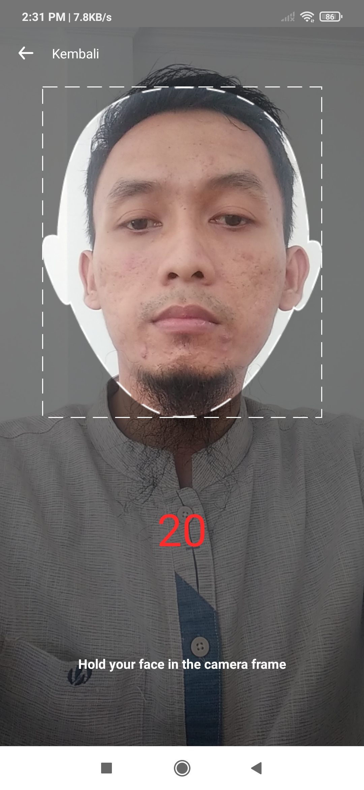
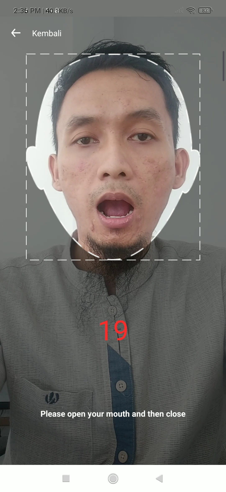
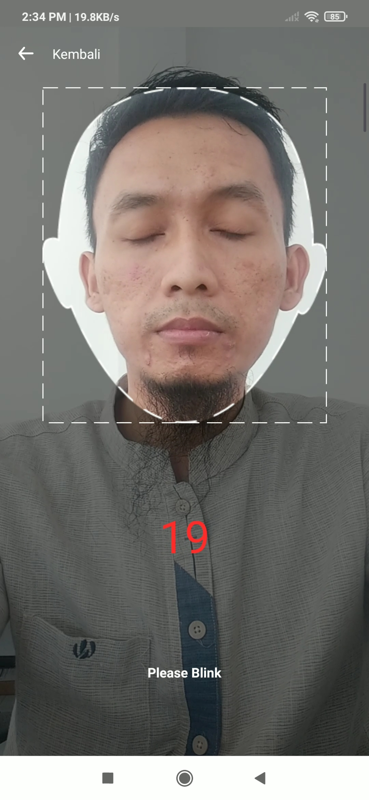

# MNC Identifier SDK
MNC Identifier is a service to identify, and verify consumer with AI in it.

## Feature
### Liveness Detection

Liveness Detection using mlkit face recognition to detect live person present at the point of capture.

## Requirements
- Min SDK 21

## Setup

build.gradle (root)

```groovy
repositories {
	...
	maven { url 'https://jitpack.io' }
}
```

build.gradle (app)
```groovy
dependencies{
	implementation "com.github.mncinnovation.mnc-identifiersdk-android:core:1.0.1"
	implementation "com.github.mncinnovation.mnc-identifiersdk-android:face-detection:1.0.1"  
}
```

AndroidManifest.xml
```xml
  <application ...> 
  ... 
  <meta-data 
	  android:name="com.google.mlkit.vision.DEPENDENCIES"
	  android:value="face"  />  
</application>
```

## How To Use
Start liveness activity
```kotlin
startActivityForResult(MNCIdentifier.getLivenessIntent(this), LIVENESS_DETECTION_REQUEST_CODE)

companion object{  
    const val LIVENESS_DETECTION_REQUEST_CODE = xxxx  
}
```

Get Liveness Result
```kotlin
override fun onActivityResult(requestCode: Int, resultCode: Int, data: Intent?) {  
    super.onActivityResult(requestCode, resultCode, data)
    if (resultCode == RESULT_OK) {
        when (requestCode) {
            LIVENESS_DETECTION_REQUEST_CODE -> {
                //get liveness result
                val livenessResult = MNCIdentifier.getLivenessResult(data)
                livenessResult?.let { result ->
                    if (result.isSuccess) {  // check if liveness detection success
                        // get image result
                        val bitmap = result.getBitmap(this, DetectionMode.SMILE)
                    } else {  //Liveness Detection Error
                        //get Error Message
                        val errorMessage = result.errorMessage
                    }
                }
            }
        }
    }
}
```

## Customize Detection Sequence
Default detection sequence is HOLD_STILL > BLINK > OPEN_MOUTH > SHAKE_HEAD > SMILE. You can cutomize detection sequence using following method

```kotlin
//the first boolean value indicates if the given detection sequence should be shuffled.
MNCIdentifier.setDetectionModeSequence(false, listOf(  
  DetectionMode.HOLD_STILL,  
  DetectionMode.BLINK,  
  DetectionMode.OPEN_MOUTH,  
  DetectionMode.SMILE,  
  DetectionMode.SHAKE_HEAD))
  ```

## Screenshoots




